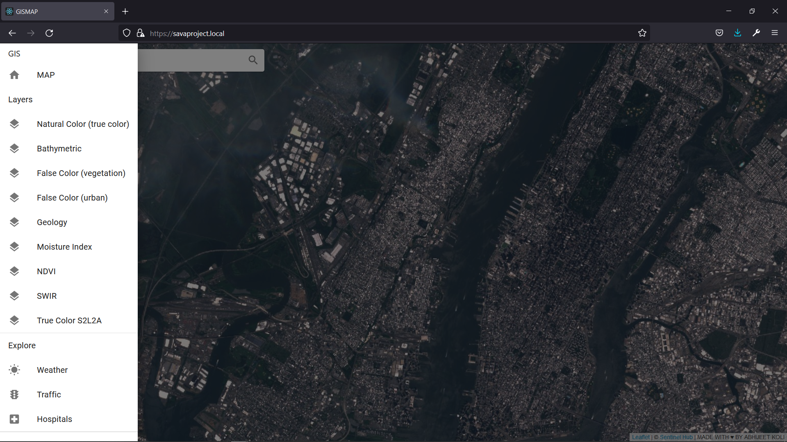

# Kubernetes GIS

Kubernetes manifests for building GIS services and applications


#### Requirements

[Docker Engine](https://docs.docker.com/engine/install/ubuntu/)

[Docker Compose](https://docs.docker.com/compose/)

[Kubernetes Cluster](https://kubernetes.io/docs/setup/)

[kubefonfig File](https://kubernetes.io/docs/concepts/configuration/organize-cluster-access-kubeconfig/)

[SentinelHub Instance ID](https://www.sentinel-hub.com/faq/where-get-instance-id/)


#### Deploy Images

```shell
cd /mnt/d/git/gis

docker-compose -f docker-compose-dockerhub.yml -f docker-compose-dockerhub.override.yml build geoserver
docker-compose -f docker-compose-dockerhub.yml -f docker-compose-dockerhub.override.yml build gismap
docker-compose -f docker-compose-dockerhub.yml -f docker-compose-dockerhub.override.yml push geoserver
docker-compose -f docker-compose-dockerhub.yml -f docker-compose-dockerhub.override.yml push gismap
```


#### Kubernetes

```shell
cd /mnt/d/git/gis

#namespace
kubectl --kubeconfig ~/.kube/gis.config apply  \
	-f ./scripts/kubernetes/gis/gis-namespace.yaml  
	
#networking
kubectl --kubeconfig ~/.kube/gis.config apply  \
                -f ./scripts/kubernetes/gis/gis-ingress.yaml  
#geoserver
kubectl --kubeconfig ~/.kube/gis.config apply  \
	-f ./scripts/kubernetes/gis/geoserver-service.yaml \
	-f ./scripts/kubernetes/gis/geoserver-deployment.yaml

#gismap
kubectl --kubeconfig ~/.kube/gis.config apply  \
	-f ./scripts/kubernetes/gis/gismap-service.yaml \
	-f ./scripts/kubernetes/gis/gismap-deployment.yaml
```


#### Docker

```shell
docker run -d --name geoserver abhijeetkoli/geoserver
docker run -d --name gismap abhijeetkoli/gismap
```


#### URLs

```shell
#geoserver
https://savaproject.local/geoserver

#gismap
https://savaproject.local
```


#### Screens



